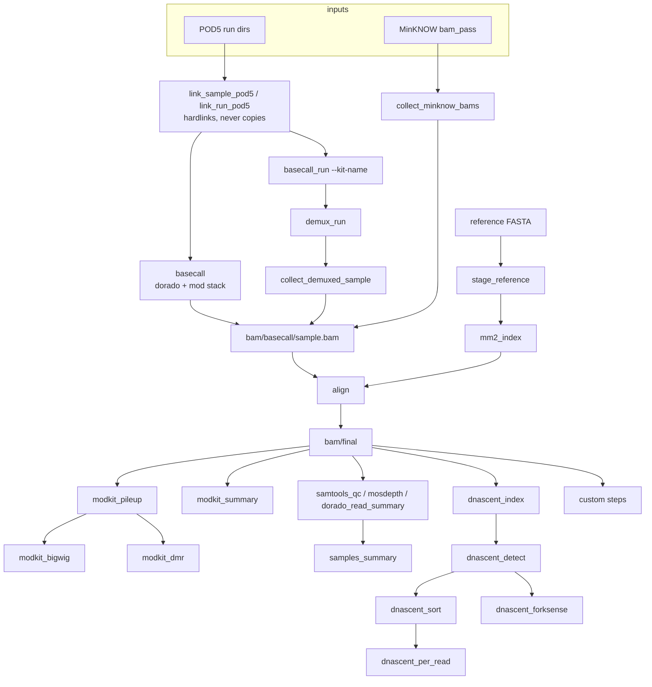

# Architecture

```
workflow/Snakefile              entry point: onstart PATH prefix (dorado, escpod) + strict-mode shell prefix, includes, rule all
workflow/rules/common.smk       samples + modes, model stack, references, cleanup tiers, pipeline_outputs()
workflow/rules/basecall.smk     POD5 staging (links), basecall / basecall_run + demux / MinKNOW collection
workflow/rules/align.smk        stage_reference, mm2_index, align (dorado aligner | minimap2), finalize_bam
workflow/rules/modcall.smk      modkit pileup / summary / extract calls / bigwig / dmr
workflow/rules/qc.smk           samtools, mosdepth, dorado summary, samples_summary
workflow/rules/dnascent.smk     index, detect (GPU), sort, per-read table, forkSense (included only if enabled)
workflow/rules/custom.smk       generic {step} rules driven by config `custom:`
workflow/rules/clean.smk        `snakemake clean`
workflow/scripts/models.py      the model resolver (also the CLI behind list-/check-/install-models)
workflow/scripts/samples.py     samples file parser: TSV / YAML, modes basecall | demux | prebasecalled
workflow/scripts/custom_steps.py, link_pod5.py, dnascent_per_read.py, summarize_samples.py, generate_manifest.py
config/config-base.yml          every key, documented; projects layer over it
cluster/bodhi, cluster/alpine   Slurm profiles (partition / account / qos / gres per rule)
scripts/setup-tools.sh          dorado / models / escpod install with pinned checksums; install-dnascent.sh
tests/unit                      pytest over the scripts (no data needed)
```

## Data flow



## Design points

- **Three input modes.** `samples.py` classifies each sample as `basecall`,
  `demux` or `prebasecalled`. Three rules write
  `bam/basecall/{sample}/{sample}.bam`; `mode_constraint()` in `common.smk`
  gives each a wildcard regex over exactly its samples, so the DAG stays
  unambiguous without `ruleorder`.
- **POD5 is never copied.** `link_pod5.py` hardlinks (same filesystem) or
  symlinks into `output_directory/pod5/`, prefixing names with the input
  ordinal so two runs that reuse a basename cannot collide. dorado
  (`--recursive`) and DNAscent index read that directory.
- **Model stack.** `models.py` resolves `models.simplex` +
  `models.modified_bases` (short codes → pinned names through
  `models.mod_versions`) + `models.custom` (local dirs), refuses two models
  on one canonical base and mod models from another simplex model, and hands
  dorado `--modified-bases-models a,b,c`. Each model's `config.toml` is a
  rule input, so swapping a model reruns basecalling.
- **Resume.** The basecall shell writes `<out>.bam.partial` outside the
  declared outputs (so a failed job does not delete it) and passes
  `--resume-from` on the next attempt.
- **Alignment keeps every tag.** `dorado aligner --no-sort | samtools view
  -F 0x904 | samtools sort`; the minimap2 alternative streams
  `samtools fastq -T '*'` into `minimap2 -y`. `bam/final` is a hardlink of
  `bam/aligned`, so cleaning the intermediate never breaks a consumer.
- **DNAscent** runs through `singularity exec --nv -B <site paths>` or a
  native binary. Every path it is given is absolute; forkSense runs inside
  `dnascent/<s>/forksense/` because it writes fixed-name BED files to the
  working directory.
- **Custom steps** are two generic rules (`custom_sample_step`,
  `custom_project_step`) whose command, inputs, threads and memory come from
  the config entry; a `.done` sentinel plus an output-existence check make a
  step that produced nothing fail loudly.
- **Strict shell.** `shell.prefix()` in `onstart` replaces snakemake's
  default prefix, so it re-states `set -euo pipefail`; without it a failing
  producer in a pipe would look like success.
- **Cluster profiles** use a per-rule `qos` resource (Alpine) rather than a
  profile-wide `slurm-qos`, and `slurm-status-command: squeue` (Bodhi), where
  a controller inside a compute-node session cannot always reach `slurmdbd`.
