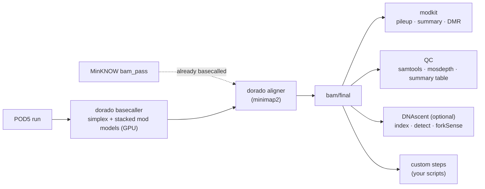

# nanopore-dna-modification-pipeline

A Snakemake pipeline for Oxford Nanopore **DNA** sequencing runs. It takes a
run directory of POD5 files and produces aligned modBAMs, modification tables
and QC, with the basecalling model stack, the analysis steps and the cluster
all chosen in one config file.

## What it does

| Stage | Tool | Configured by |
|---|---|---|
| Basecalling with modified bases | dorado 2.1.2, one simplex model + any number of modified-base models on different canonical bases, ONT's or your own | `models:` |
| Barcoded runs | one dorado pass with `--kit-name`, then `dorado demux` | samples file `kit:` |
| Already-basecalled runs | MinKNOW `bam_pass` used as-is | samples file `basecalled: true` |
| Alignment | `dorado aligner` (all tags kept) or minimap2 | `align:` |
| Modification tables | modkit pileup (bedMethyl), summary, per-read calls, bigWig, DMR | `modkit:`, `dmr:` |
| QC | samtools flagstat/stats, mosdepth, dorado summary, one summary table per project | `qc:` |
| Replication analogues | DNAscent index, detect, per-read BrdU/EdU table, forkSense | `dnascent:` |
| Anything else | your own commands as first-class rules | `custom:` |

Everything is installed and run through [pixi](https://pixi.sh). Slurm
profiles are provided for **Bodhi** and **Alpine**, with dorado and DNAscent on
the GPU queues.

## Where to start

- New to the pipeline and holding a run directory? Follow the
  [walkthrough](getting-started/walkthrough.md).
- Installing on a cluster: [Installation](getting-started/installation.md),
  then [Bodhi](cluster/bodhi.md) or [Alpine](cluster/alpine.md).
- Every config key: [Configuration](user-guide/configuration.md).

## Status

Version 0.1.0. The dorado, alignment, modkit and QC paths are exercised by
dry runs and unit tests in CI; the DNAscent GPU resource sizing is tracked in
[issue #1](https://github.com/rnabioco/nanopore-dna-modification-pipeline/issues/1).
